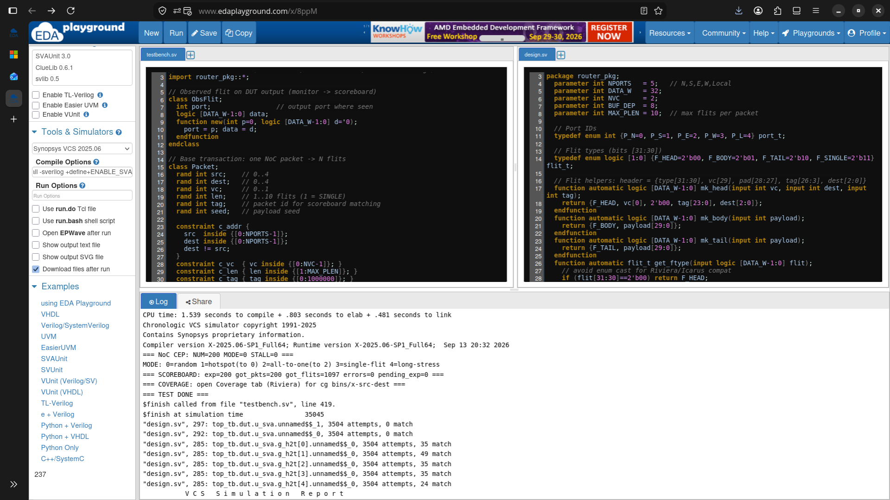

# NoC Router — Constrained-Random Verification in SystemVerilog


Functional verification of a **5-port NoC mesh router with virtual channels** using a
coverage-driven, layered SystemVerilog testbench — no UVM, pure SV (classes, mailboxes,
constrained randomization, concurrent assertions, covergroups).

> Course project — **A8451 SystemVerilog for Verification**, B.Tech R22 · Team of 3.

## DUT

5-port (N/S/E/W/Local) wormhole router, `DATA_W=32`, 2 virtual channels, 8-flit buffers,
XY (destination-port) routing, per-output round-robin arbitration with wormhole locking
(HEAD locks the output until its TAIL transfers) and standard VALID/READY stall-hold.

| Flit | Encoding |
|------|----------|
| Header | `{type[31:30], vc[29], pad[28:27], tag[26:3], dest[2:0]}` |
| Body / Tail | `{type[31:30], payload[29:0]}` — bit[29] is payload, **not** VC |

## Testbench architecture

```
Generator --(Packet mailbox)--> Driver --(vif.drv_cb)--> ┌────────────┐
    │                                                    │ noc_router │--(vif.mon_cb)--> Monitor --(ObsFlit mailbox)--> Scoreboard
    ├──(expected, by tag)--> Scoreboard (golden rebuild, order-independent)                             │
    └──(descriptors)--> Coverage (covergroup: src × dest × vc × len)                     sva_checker (bind, no RTL edits)
```

| Component | What it does |
|-----------|--------------|
| `Packet` → `HotspotPacket extends Packet` | Constrained-random transactions; inheritance + polymorphism |
| `Generator` | Directed + random + hotspot + all-to-one + long-packet stress (modes 0–4) |
| `Driver` | Drives all 5 ports via clocking block; injects output backpressure in stall mode |
| `Monitor` | Samples every accepted output flit |
| `Scoreboard` | Tag-matched, order-independent packet check against golden flit rebuild |
| `RouterCoverage` | Coverpoints on src/dest/vc/len + 3 crosses |
| `sva_checker` | 5 asserts (stability, hold, no-X, legal dest, liveness) + 3 covers |

## Repo layout

```
design.sv      DUT side (EDA Design pane):  package → interface → noc_router → sva_checker
testbench.sv   TB side (EDA Testbench pane): 9 classes → Env → top_tb (+NUM/+MODE/+STALL)
logs/          trimmed VCS transcripts, one per regression run
screenshots/   matching EDA Playground screenshots
```

## Quick start (free, EDA Playground)

1. edaplayground.com → *Testbench+Design = SystemVerilog* → Simulator = **Synopsys VCS**.
   (Free Riviera-PRO blocks `rand`/`mailbox`/`covergroup`/`assert` — needs a paid license.)
2. Paste `design.sv` / `testbench.sv` into the Design / Testbench panes.
3. Compile Options: `-timescale=1ns/1ns +vcs+flush+all +warn=all -sverilog +define+ENABLE_SVA`
4. Run Options per test (Run Time 10 ms) — pass = `errors=0 pending_exp=0`, no `[SVA]` errors.

## Regression results (VCS 2025.06, `+define+ENABLE_SVA`)

| ID | Run Options | exp | got | flits | errors | pending | Time | Covers |
|----|-------------|-----|-----|-------|--------|---------|------|--------|
| T1 | `+NUM=200 +MODE=0 +STALL=0` | 200 | 200 | 1097 | 0 | 0 | 35045ns | random |
| T2 | `+NUM=20 +MODE=3 +STALL=0` | 20 | 20 | 20 | 0 | 0 | 8045ns | single-flit directed |
| T3 | `+NUM=300 +MODE=1 +STALL=0` | 300 | 300 | 1622 | 0 | 0 | 50045ns | hotspot-to-0 (266 HEAD→TAIL matches on out[0]) |
| T4 | `+NUM=200 +MODE=0 +STALL=1` | 200 | 200 | 1097 | 0 | 0 | 35045ns | backpressure |
| T5 | `+NUM=1000 +MODE=4 +STALL=1` | 1000 | 1000 | 8010 | 0 | 0 | 270045ns | long-packet stress |

Full transcripts: [`logs/`](logs). Screenshots: [`screenshots/`](screenshots).



## Bugs found and fixed (caught by this TB)

1. **VC-decode** — BODY/TAIL took VC from payload bit[29], scattering flits across VCs
   (len / wrong-dest / unknown-tag errors). Fix: `cur_vc[i]` per input, HEAD sets it, BODY follows.
2. **STALL-HOLD** — re-arbitration under `!ready` changed `data_out` while `valid=1`
   (hold-check fail + 1-flit loss). Fix: freeze `data_out`/`valid` while stalled.

## Course mapping (A8451)

| CO | Demonstrated by |
|----|-----------------|
| A8451.1 Methodology, data types | Layered TB, virtual interface, queues / associative arrays |
| A8451.2 Procedural code, assertions | Interface clocking blocks, 8 SVAs via `bind` |
| A8451.3 Functional coverage | Covergroup on src/dest/vc/len + 3 crosses |
| A8451.4 OOP | Packet → HotspotPacket inheritance, mailboxes, Env composition |
| A8451.5 Randomization | `rand` + constraints + inline `with` + `pre_randomize` |
