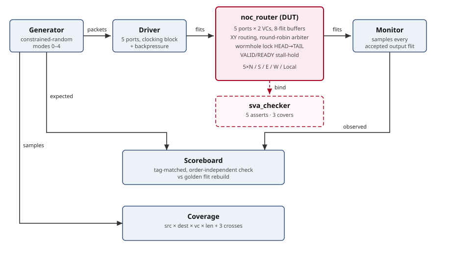
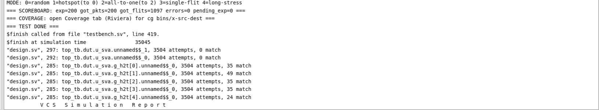

# Constrained-Random and Assertion-Based Layered Testbench for Verification of 5-Port NoC Mesh Router with Virtual Channels using SystemVerilog


Functional verification of a 5-port wormhole NoC mesh router (2 virtual channels,
XY routing, round-robin arbitration) with a pure-SystemVerilog layered testbench —
constrained-random stimulus, concurrent assertions and functional coverage, no UVM.
Reproduces for free on EDA Playground.



## Proof at a glance

T1 run, straight from the simulator log — 200/200 packets, 0 errors, HEAD→TAIL
assertion covers matching on all 5 outputs:



## Repository layout

```
design.sv      package → interface → DUT → SVA checker (EDA Design pane)
testbench.sv   9 TB classes → Env → top_tb (EDA Testbench pane)
docs/          architecture diagram + the proof screenshot above
logs/          trimmed VCS transcripts of all 5 runs
screenshots/   full EDA Playground screenshots of the same runs
```

## Getting started

Prerequisites: a free [EDA Playground](https://www.edaplayground.com) account,
simulator set to **Synopsys VCS**. (The free Riviera-PRO build blocks
`rand` / `mailbox` / `covergroup` / `assert`, so this project cannot run there.)

1. Paste `design.sv` and `testbench.sv` into the Design and Testbench panes.
2. Compile Options:
   `-timescale=1ns/1ns +vcs+flush+all +warn=all -sverilog +define+ENABLE_SVA`
3. Set Run Options to any row below (Run Time 10 ms) and Run. A passing run prints
   `errors=0 pending_exp=0` with no `[SVA]` errors.

| Run | Options | Sent | Got | Flits | Errors | Time |
|-----|---------|------|-----|-------|--------|------|
| T1 | `+NUM=200 +MODE=0 +STALL=0` | 200 | 200 | 1097 | 0 | 35045ns |
| T2 | `+NUM=20 +MODE=3 +STALL=0` | 20 | 20 | 20 | 0 | 8045ns |
| T3 | `+NUM=300 +MODE=1 +STALL=0` | 300 | 300 | 1622 | 0 | 50045ns |
| T4 | `+NUM=200 +MODE=0 +STALL=1` | 200 | 200 | 1097 | 0 | 35045ns |
| T5 | `+NUM=1000 +MODE=4 +STALL=1` | 1000 | 1000 | 8010 | 0 | 270045ns |

Modes: 0 random · 1 hotspot (to port 0) · 2 all-to-one (to port 2) ·
3 single-flit directed · 4 long-packet stress. Full transcripts in [`logs/`](logs).

## Testbench

The generator produces constrained-random packets; the driver pushes them into all
5 input ports through a clocking block and can inject output backpressure. The
monitor collects every accepted output flit, and the scoreboard matches whole
packets by header tag against a golden rebuild, so packets may arrive in any order.
A covergroup samples every packet descriptor (src × dest × vc × len), and the
assertion checker (5 asserts, 3 covers) is bound to the DUT without touching RTL.

Flit encoding: header `{type[31:30], vc[29], pad[28:27], tag[26:3], dest[2:0]}`,
body/tail `{type[31:30], payload[29:0]}` (bit 29 is payload there, not VC).

## Verification notes

Two real DUT bugs were caught by this testbench during development:

1. **VC decode** — BODY/TAIL flits took their VC from payload bit 29, scattering
   one packet across VC FIFOs so it never reassembled. Fixed with a per-input
   `cur_vc` register set by each HEAD.
2. **Stall hold** — re-arbitration while stalled changed `data_out` under
   `valid=1`, dropping a flit per stall. Fixed by freezing `data_out`/`valid`
   until the stall clears.
